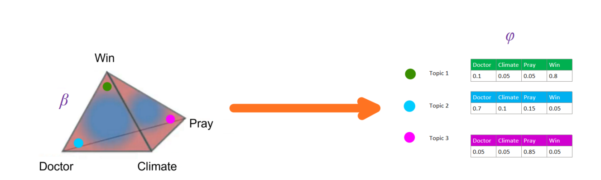

### Sample a Word

Now we'll do the same for topics and words. Lets say for the sake of viz we only have 4 words as shown. This here is in 3D, and not a triangle. If we have more words, we'd still have a Dirichlet distribution except it would be in much higher simplex.

Each point would generate the respective multinomial distribution as show by the colors.

Notice that we don't what topics these words belong to. We just know them as topic 1, 2 and 3. After some inspection we can infer that:

- Topic 1 is close to "win" and must be related to Sports  
- Topic 2 is close to "doctor" and must be related to Medicine  
- Topic 3 is close to "pray" and must be related to Religion       

### Combining Both the steps (i.e., Sampling a Topic and Sampling a Word)

Using the points (documents) in the Dirichlet distribution for Topics ($\bm{\alpha}$), we draw some topics from the multinomial distribution $\bm{\theta}$.

Next, we associate words to these topics. How can we do that? Using the Dirichlet distribution $\bm{\beta}$. In this distribution we locate the topics somewhere and from each of the dots, we obtain the distribution of the words generated by each of the topics. This distribution is called $\bm{\Phi}$.

We use this to combine to create some fake documents by following the above method, and then compare these with the Real documents that we have. The probability of obtaining the real documents is really small (ofcourse!). But there must be some arrangement of points in the above distributions that Maximizes it's probability. Our goal is to find these arrangements of points and that will give our topics. 

Just like any Machine Learning Algorithm, we now have a prediction and a true value. Hence, we can calculate the error between the two, and back propagate all the way to the distributions and update the gradient. This will update the model and make it learn. 

